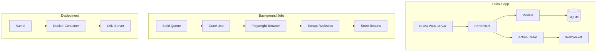
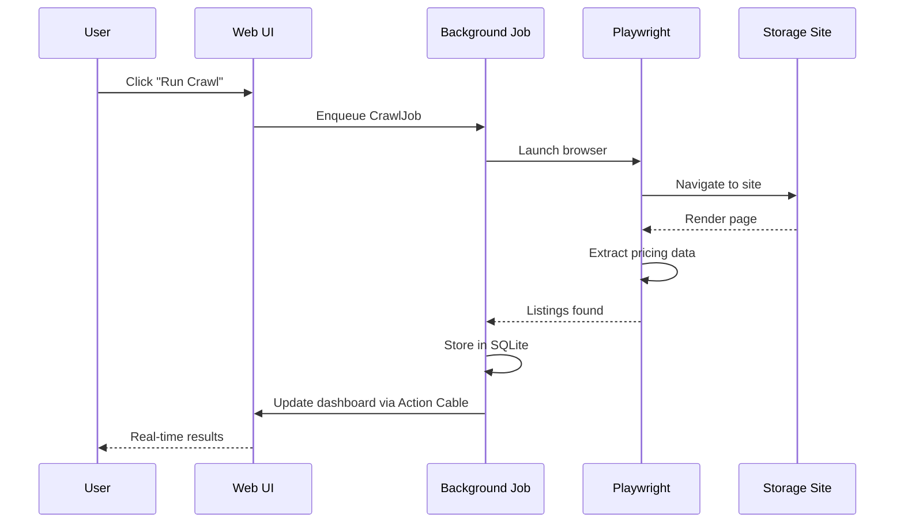
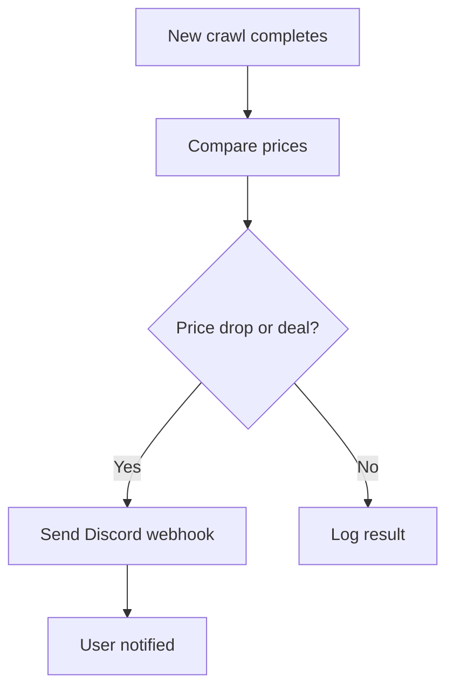

# landonkea-storagefinder — Design & Workflow

## High-Level Overview

## Crawl Workflow

## Alert Flow

## File Relationships

| File | Purpose | Used By |
|------|---------|---------|
| `app/controllers/` | HTTP handlers | Puma |
| `app/models/` | Business logic | Controllers |
| `app/jobs/` | Background jobs | Solid Queue |
| `app/channels/` | WebSocket updates | Action Cable |
| `config/deploy.yml` | Kamal config | Deployment |
| `db/` | SQLite schema | Models |

## draw.io

[Open in draw.io](https://app.diagrams.net/#RStorageFinder%20architecture)
